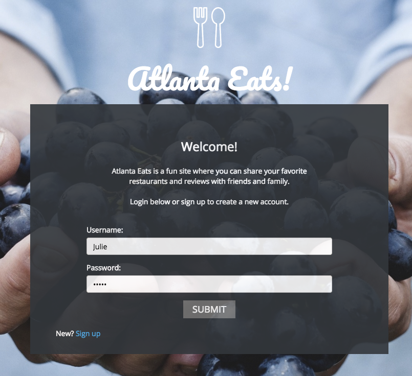
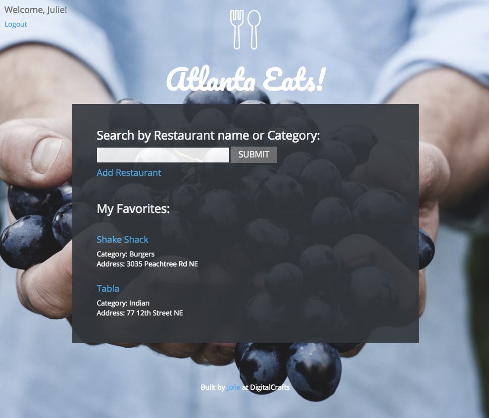
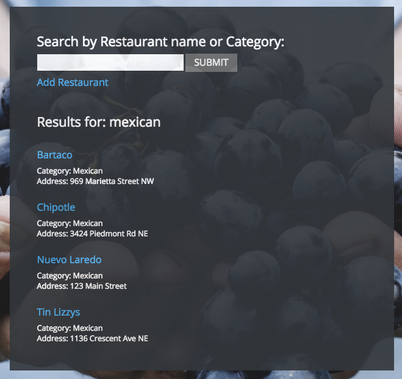
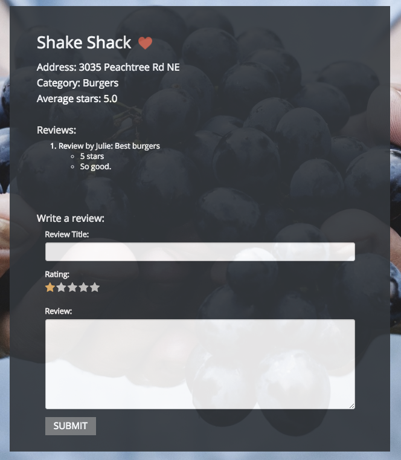
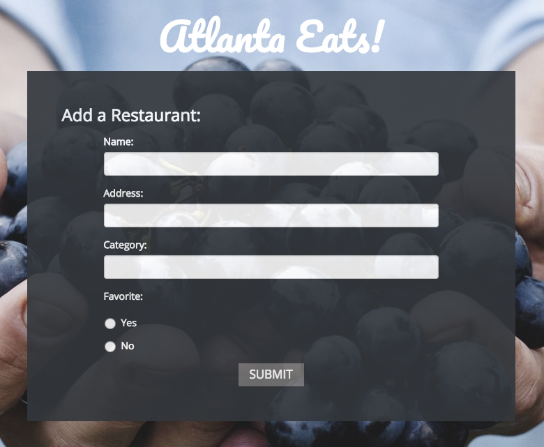
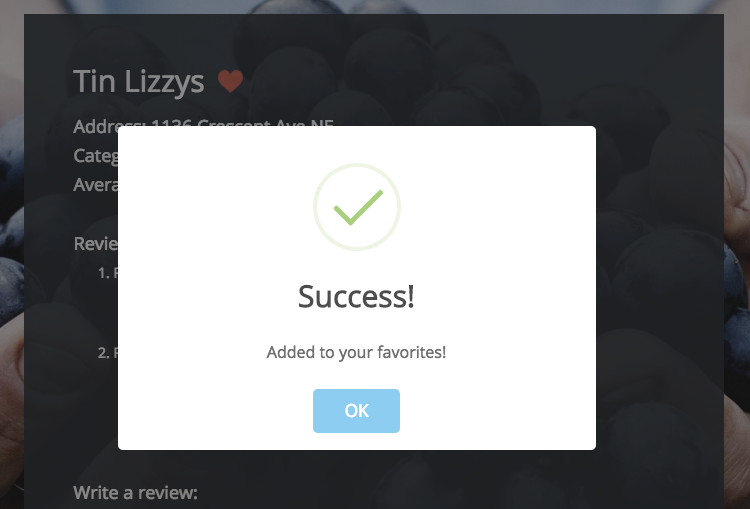

# Atlanta Eats
---
## [Live Site](http://restaurant-reviewer.juliemdyer.com/)
If you don't want to create an account you can use the demo account below. to play around.<br>
Login: demo <br>
Password: demo

## What It Is
Atlanta Eats is a yelp clone application. Users can create an account or sign in, search restaurants, add new restaurants, write reviews, ratings and favorite / unfavorite restaurants.

## What I used
* HTML
* CSS
* JavaScript
* jQuery
* Node.js
* PostgreSQL
* Handlebars (for templating)
* Ajax
* Express
* SweetAlert (jQuery plugin, used for pop up alerts and notifications)
* bcrypt (node module, used to store encrypted passwords into the database)
* express-session (node module, used to keep the current user logged in and save information about that user.)


## Site Walkthrough
### Landing page
Users see a brief welcome message and can either log in or create an account.
<p align='center'>
    </img>
</p>

### User's Home page
Top left corner shows their name indicting and the Logout link. The user also sees the search box, Add Restaurant link, and list of their favorite restaurants.
<p align='center'>
    </img>
</p>


### Search results
Users can search by name or category and will be given a list of results. They can then click on any of the restaurants to be taken to that restaurant's home page.
<p align='center'>
    </img>
</p>


### Restaurant Home page
If the restaurant is a favorite of the user the heart icon will be filled in red. Information about the restaurant is displayed along with it's average star rating. The user can see current reviews and also write their own review and include a star rating.
<p align='center'>
    </img>
</p>

### Add Restaurant
Users can add new restaurants and indicate whether or not that restaurant is a favorite. After submitting the user will be taken to the Restaurant homepage for the newly created restaurant record.
<p align='center'>
    </img>
</p>

### Add to favorites
At any time users can add a new restaurant to their favorites by clicking the heart next to the restaurant's name. A notification will appear letting the user know that the favorite has been added. If the user goes back to their homepage they will see the newly favorited restaurant added.
<p align='center'>
    </img>
</p>

## Challenges

### Challenge 1 - Working with Ajax
At the time of making this website I didn't know how to use Ajax, so I didn't know how to get my back end javascript file to talk to my front end javascript file. Up until this point I had only been using Express with res.redirect or res.render, so whenever I wanted to do something say after a database query or entry, I had to either redirect to a new page or render a page. But I wanted to display an alert instead, enter Ajax! <br>
Now instead of redirecting I was

Client side JavaScript for clicking the submit button on the login page. This event originates in the client side and then goes over to the server side via Ajax. The login details are sent over in the data object.
```JavaScript
$('#submit_login').click(function() {
    $.ajax({
        url: "/submit_login",
        type: "POST",
        data: {
            username: $('.username').val(),
            password: $('.password').val(),
        }
    })
    .then(function(response) {
        check(response);
    })
    .catch(function(err) {
        console.log(err.message);
    });
});
```

Server side JavaScript file. This route receives the information from Ajax and 'unpacks' the data. It then queries the database. If the login is successful the user session details are set and a response of "match" is sent back to the client side javascript file. If there is a problem, the response "fail" is sent.
```JavaScript
app.post('/submit_login', function(req, res, next) {
    var username = req.body.username;
    var password = req.body.password;
    db.one("SELECT id, first, username, password FROM reviewer WHERE username = $1", username)
        .then(function(loginDetails) {
            return [loginDetails, bcrypt.compare(password, loginDetails.password)];
        })
        .spread(function(loginDetails, matched) {
            if (matched) {
                req.session.user = loginDetails.first;
                req.session.user_id = loginDetails.id;
                res.send('match');
            } else {
                res.send('fail');
            }
        })
        .catch(function(err) {
            console.log(err.message);
            res.send('fail');
        });
});
```
Back in the client side javascript file the function check(response) is run. Depending on the response, for example "match", "fail" etc a different event will happen. In this case if "match" comes back as the response, the user is re-directed to their home page. If "fail" is the response, a pop up appears telling the user there was a problem and they need to try logging in again.


### Challenge 2 - Adding Favorites
I wanted the user to be able to click a heart icon to favorite and un favorite different restaurants. The first challenge was how to change the heart. I ended up just swapping the image attribute and adding/removing favorite classes depending on the state of the heart at the time of click. After that started working I added Ajax to send the data over to the server side and update the database accordingly.

Client side javascript. This function runs whenever the heart is clicked. If it's already a favorite, it will be un-favorited, and vice versa.
```JavaScript
$('.heart').click(function() {
    var id = $('#hidden-id').text();
    if ($(this).hasClass('not-favorite')) {
        swal("Success!", "Added to your favorites!", "success");
        $(this).attr('src', '/like.png').addClass('favorite').removeClass('not-favorite');
        $.ajax({
              type: "POST",
              url: '/restaurant/add_favorite/' + id,
              data: { favorite : true }
            });
    } else if ($(this).hasClass('favorite')) {
        $(this).attr('src', '/heart.png').addClass('not-favorite').removeClass('favorite');
        $.ajax({
              type: "POST",
              url: '/restaurant/add_favorite/' + id,
              data: { favorite : false }
            });
    }
});
```

Server side JavaScript. From Ajax this route is called and depending on the value of the favorite key that restaurant record will either be added or removed from the user's favorites.
```JavaScript
app.post('/restaurant/add_favorite/:id', function(req, res, next) {
    var id = req.params.id;
    var favorite = req.body.favorite;
    if (favorite === "true") {
        db.none("insert into favorites values ($1, $2)", [id, req.session.user_id]);
    } else if (favorite === "false") {
        db.none("delete from favorites where restaurant_id = $1 and reviewer_id = $2", [id, req.session.user_id]);
    }
});
```
